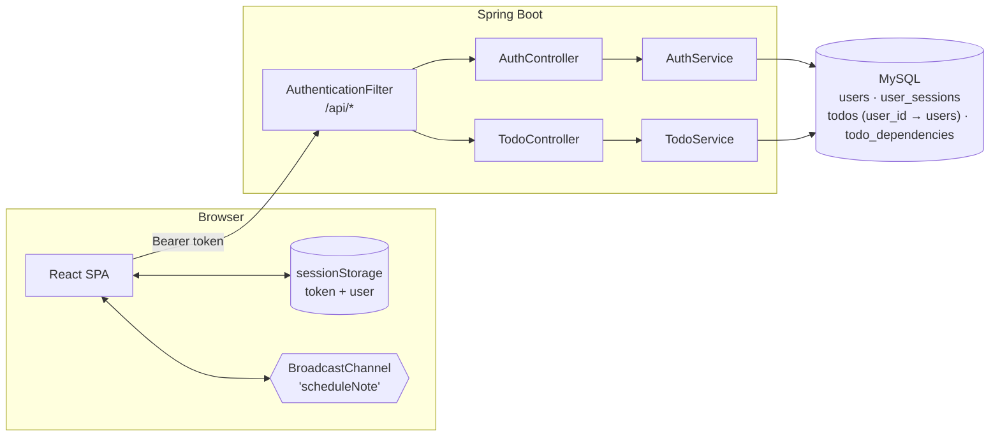
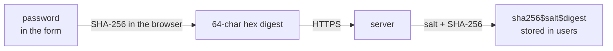
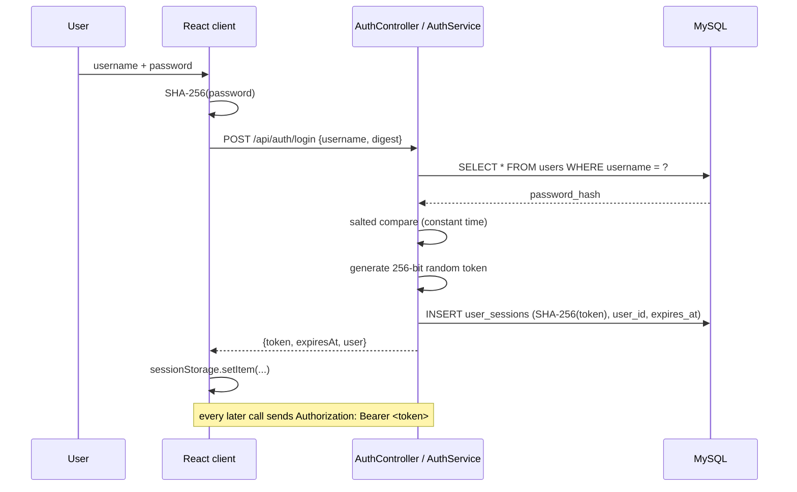
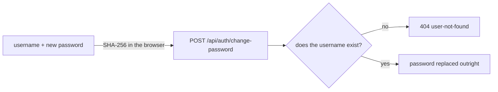
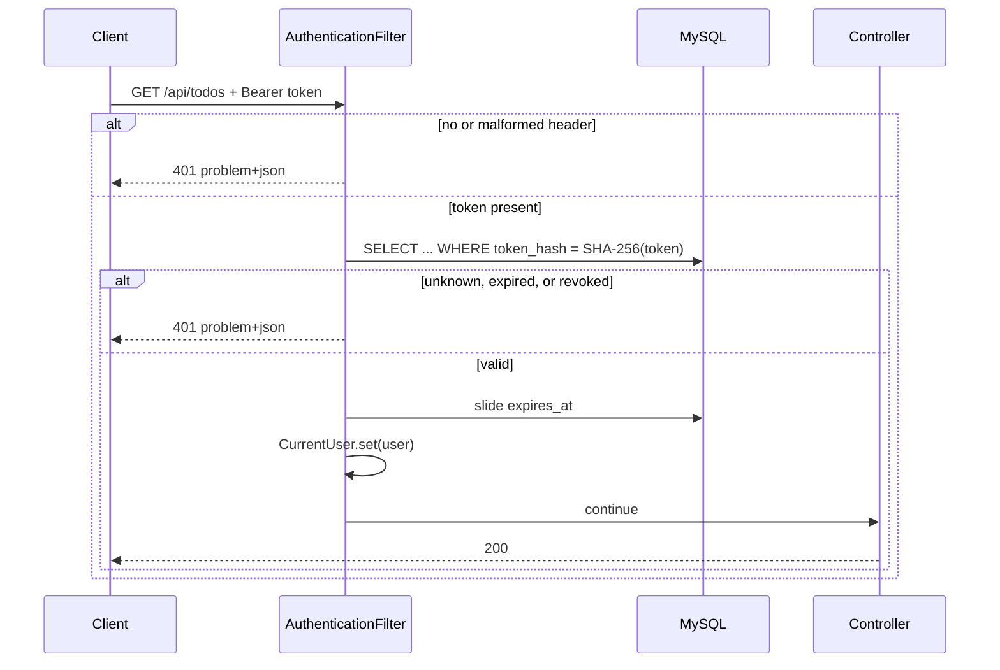
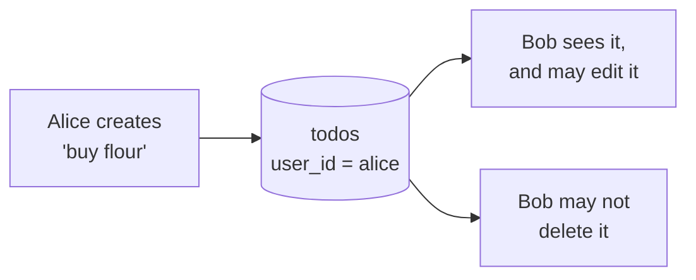
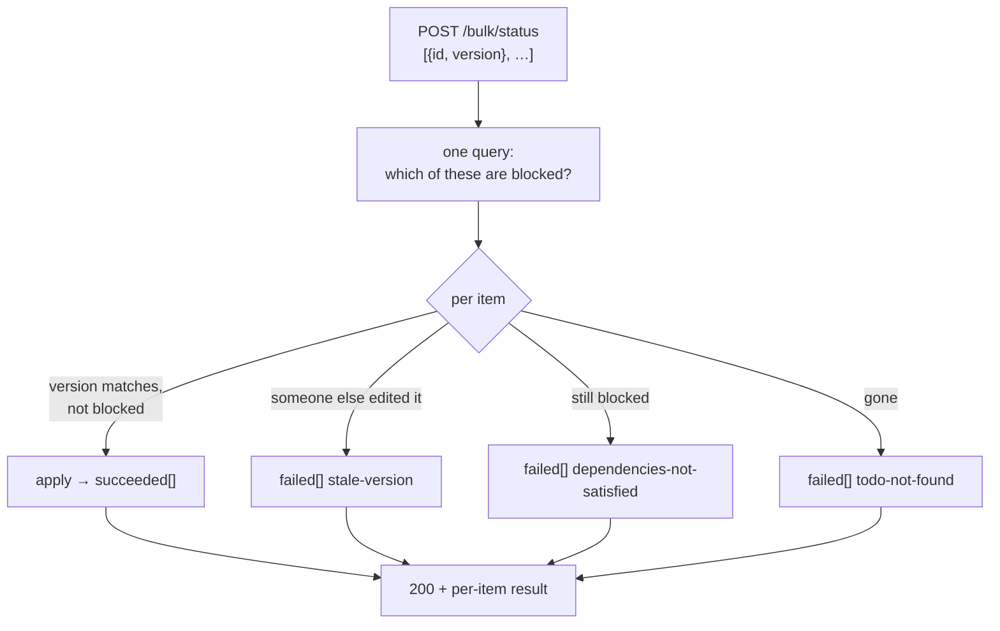
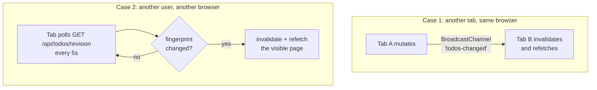
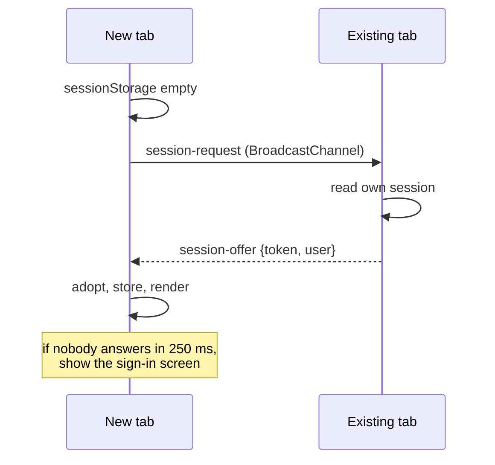

# Architecture

Three things are described here: **authentication with database-backed
sessions**, **one shared list with ownership recorded on every row**, and
**keeping every open client current**. The rest of the system is covered in the
[decision log](DECISION_LOG.md).

## System overview



A second browser tab is a second copy of the `Browser` box. Tabs share the
BroadcastChannel; they do **not** share sessionStorage, which is what the
handshake below is for.

## Authentication

### Where hashing happens, and why twice



The two steps solve different problems, and neither replaces the other:

| Step | Protects against | Does **not** protect against |
|---|---|---|
| Client-side SHA-256 | The server, its logs, and anything on the path ever seeing the real password — which matters because people reuse passwords | Anyone who steals the digest: to this API, the digest *is* the password |
| Server-side salted SHA-256 | A stolen `users` table revealing credentials; identical passwords sharing a digest | Brute force — SHA-256 is fast |

**SHA-256 is a starting point, not a destination.** It is designed to be fast,
which is the opposite of what a password digest wants: commodity hardware tests
billions of candidates a second. The salt defeats rainbow tables and stops two
users with the same password sharing a digest, but it does nothing about brute
force.

The upgrade is deliberately cheap. Every digest records the algorithm that wrote
it, so more than one can coexist:

```
sha256$Zk3n…$816a01455a4f…
└────┘
 algorithm
```

Introducing Argon2 means adding one `PasswordHasher` implementation and making
it primary. `AuthService.login` already re-hashes any digest whose prefix is not
the current algorithm, at the one moment the password is available. No
migration, no forced reset, no downtime.

### Sign-in and the session



Three properties worth stating explicitly:

- **The token is opaque, not a JWT.** Sessions live in the database, so
  revocation is an `UPDATE` — no blocklist, no waiting for a short expiry. That
  is what "a session generated in db" asks for, and it is the right trade for
  a single service where the extra round trip is a primary-key lookup.
- **Only `SHA-256(token)` is stored.** Reading `user_sessions` yields nothing
  usable, the same reasoning that applies to passwords.
- **Expiry slides.** Each authenticated request pushes `expires_at` forward, so
  an active user is not signed out mid-task, while an abandoned session still
  ages out.

### Changing a password

`POST /api/auth/change-password` takes a username and a new digest, and **asks
for nothing else** — no current password, no emailed link. It is an open
endpoint, alongside register and login.



**Stated plainly: anyone who knows a username can take that account over.** The
reason it is built this way is that there is nowhere for a reset link to go —
no email is collected at registration — and an account with no recovery path at
all is its own kind of failure for a demo. The honest position is that this is
a placeholder for a real recovery flow, not a design to keep: collecting an
email address and mailing a single-use, expiring token is the change to make
before anyone real depends on it, and rate limiting is needed either way.

### Request path



`/api/auth/register`, `/api/auth/login` and `/api/auth/change-password` are
open — otherwise no token could ever be obtained, and no forgotten password
could ever be recovered. Swagger UI and `/actuator/health` sit outside `/api` and are
untouched by the filter. CORS preflights pass through, because a browser never
attaches credentials to them and a 401 there surfaces as an opaque CORS error
rather than something a developer can act on.

## One shared list, with an owner on every row

Authentication gates *access*; it does not partition data. The requirement is
explicit that the API should "support multiple users accessing the same TODO
list concurrently" — one list, several people. Every signed-in user sees and
edits the whole list.

What each TODO does carry is the user who created it, in a `user_id` column
that the UI renders as an **Owner** column:



Ownership is **attribution, not access control** — with one exception:

| Action | Anyone signed in | Owner only |
|---|---|---|
| Read, filter, sort | ✅ | |
| Edit fields, change status, add or drop dependencies | ✅ | |
| Delete, restore | | ✅ |

Deleting is the one act reserved to the owner. Removing someone's work from a
shared list is a different kind of act from correcting it, and it is the one
that is awkward to notice after the fact — a soft-deleted TODO simply stops
appearing. Editing is recoverable by editing again; a deletion is only
recoverable if you know to look in the recycle bin. Attempting it returns `403`
with type `not-todo-owner`, and the UI dims the button rather than letting the
click fail.

An *owner filter* (`?owner=<userId>`, shown as **Only mine**) narrows the shared
list on request. It is a convenience, not a boundary: everything remains
reachable by clearing it.

### What this costs, and how it is paid

Two things had to change to make a shared list perform.

**The indexes.** An earlier iteration scoped every query by owner, and the list
indexes were led by `user_id` to match. With no owner predicate in the default
query, MySQL cannot use a `user_id`-led index at all — the leading column is
unconstrained — so it would fall back to scanning and sorting the whole table,
which is precisely the case the 10,000-row requirement is about. `V4` restores
the `deleted_at`-led covering indexes and keeps a single owner-led one for the
filter above.

**Resolving owner names.** `Todo` holds a plain `user_id` column rather than a
`@ManyToOne`, so there is no relation to lazily traverse — and no N+1 waiting to
happen. The service collects the distinct owner ids of a page and loads them in
one query, exactly as it already does for the blocked flag. One extra query per
page, regardless of page size.

## Bulk operations

Three endpoints act on many TODOs at once: `POST /api/todos/bulk/status`,
`/bulk/delete`, and `/bulk/restore`. The mechanics were cheap — every rule
already lives on the `Todo` entity, so a batch is a loop inside the existing
transaction and nothing is reimplemented. The design work was entirely in the
semantics.

### Best-effort, not all-or-nothing



In a batch, "this one is blocked" and "someone else edited this one" are
**expected outcomes for a row**, not failures of the request. Rejecting the
whole batch because one row of forty moved on would be the wrong trade: the user
would retry the same forty and hit a different single conflict. So a bulk call
returns `200` with `succeeded` and `failed` side by side, and each failure
carries the same `type` slug its single-item endpoint would have returned in its
RFC 9457 problem document — so a client branches on a stable code, not on prose.

### Why versions travel per item

Every single-item write carries the version the client last saw. A batch keeps
that guarantee by carrying one version **per item**. A single request-level
version would have no way to distinguish "this one row moved" from "everything
you are holding is stale", and would have to fail everything on one conflict.

Delete and restore take bare ids, with no versions — deliberately matching their
single-item endpoints, which do not ask for one either. Removing a TODO from the
list is not an edit of its contents, so there is no lost update to guard.

### The gate is answered once, for the whole batch

The blocked check runs as **one** `findBlockedIdsAmong` query over the batch
before anything is applied — the same query the list endpoint already uses. Two
reasons: it keeps a 200-item batch off the N+1 path, and it makes each item's
outcome independent of where it sits in the request.

### What is deliberately not here

**Bulk-by-filter.** "Complete all 10,000 matching this filter" would mean
sending the filter and letting the server resolve the set — at which point
per-item version checks become impossible by construction, because the client
never saw the rows. That is a different feature with a different safety story.
What exists is bulk-by-ids, capped at `PAGE_SIZE_MAX` (200), so a client can act
on exactly what it has seen and never on more.

Measured against the same 12,011 rows, a full 200-item batch — the cap —
applies in **79 ms**.

**A single `UPDATE` statement.** Bulk soft-delete looks like a one-line JPQL
`UPDATE todos SET deleted_at = …`. That would bypass `@Version` *and*
`@PreUpdate`, so `updated_at` would never move — and the revision fingerprint
below is derived from `MAX(updated_at)`, so every other open tab would keep
showing stale data. The batch iterates entities instead, and Hibernate's
configured statement batching (`batch_size: 50`, `order_updates`,
`rewriteBatchedStatements`) collapses the writes on the way out.

## Real-time updates

The requirement asks for a simple mechanism, not a live collaboration engine.
Two cheap ones, covering the two cases that actually differ:



### The revision endpoint

Polling the list itself would move a page of rows every five seconds per tab.
Instead clients poll a fingerprint:

```json
GET /api/todos/revision → { "lastModifiedAt": "2026-08-25T10:59:35.164911Z", "total": 12009 }
```

Two aggregates over an indexed column — **measured at 4 ms against 12,011
rows**, versus 18 ms to return an actual page. The client refetches only when
the pair changes.

- `lastModifiedAt` moves on every insert, update, **and** soft delete, because
  deletion stamps `updated_at` rather than removing the row.
- `total` covers the one case a timestamp alone could miss: two writes inside
  the same microsecond.
- The fingerprint covers the **whole shared list**, not one user's slice, which
  is what makes the cross-user case work at all: another person's edit moves it,
  and every open tab notices within one interval.

This depends on all writers agreeing on a clock. Timestamps are written by the
application in UTC; the seed script had to be corrected to `UTC_TIMESTAMP(6)`
after it wrote local time and left rows dated in the future, which masked real
edits. Worth knowing before adding another writer.

### Cross-tab messaging

`BroadcastChannel` gives same-origin tabs a message bus with no server involved,
so a change made in one tab lands in the others immediately rather than up to
five seconds later. It carries three kinds of message:

| Message | Sent when | Effect |
|---|---|---|
| `todos-changed` | after any local mutation | other tabs invalidate and refetch |
| `session-request` / `session-offer` | a new tab opens with empty sessionStorage | an existing tab hands over the session |
| `signed-out` | sign-out | other tabs return to the sign-in screen |

Every call degrades to a no-op where `BroadcastChannel` is unavailable (older
Safari); the app then relies on polling alone, which is slower but correct.

### The sessionStorage handshake

sessionStorage is per-tab by design: closing the tab ends the session and
nothing is written to disk. The cost is that opening a second tab would
otherwise demand a fresh sign-in — awkward for a feature whose entire point is
multiple tabs.



**The trade-off, stated plainly:** any same-origin tab can ask for the token.
That is no weaker than putting the token in `localStorage` — where every tab
reads it directly — but it is weaker than pure per-tab isolation. The exposure
is bounded by the same-origin policy; an XSS foothold defeats all three schemes
equally. `httpOnly` cookies would be strictly better against XSS, at the cost of
CSRF handling, which is the change I would make before this saw real users.

## Why not WebSockets or SSE

Both were considered and neither earns its cost here:

| Approach | Cost | Verdict |
|---|---|---|
| Polling a fingerprint | One 5 ms query per tab per 5 s; up to 5 s stale | **Chosen.** Stateless, survives restarts and load balancers, trivial to reason about |
| Server-Sent Events | A held connection per client; needs an event bus to fan out across instances | The natural next step if latency matters |
| WebSockets | As above, plus protocol and reconnection handling | Only worth it for bidirectional traffic — presence, cursors, live editing |

Polling cost scales with connected clients, not with list size, and the poll is
paused for hidden tabs. At the scale in the brief that is comfortable. The
upgrade path is contained: `useRealtimeSync` is the only place that decides
*when* to invalidate, so swapping the trigger for an SSE subscription touches
one hook.

## What is not built

- **No private lists.** One shared list, as the requirement describes. Ownership
  is recorded and shown, but only delete and restore act on it.
- **No roles or permissions.** Beyond owner-only deletion, every signed-in user
  can do everything.
- **No real password recovery, no email verification, and no rate limiting.**
  Sign-in is not throttled and change-password verifies nothing, which is the
  first thing a real deployment would need to fix.
- **No conflict merging.** Two people editing the same TODO still resolve
  through optimistic locking: the second writer gets a 409 and refetches. Live
  updates make that collision rarer, not impossible.
