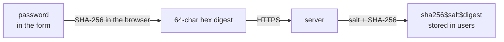
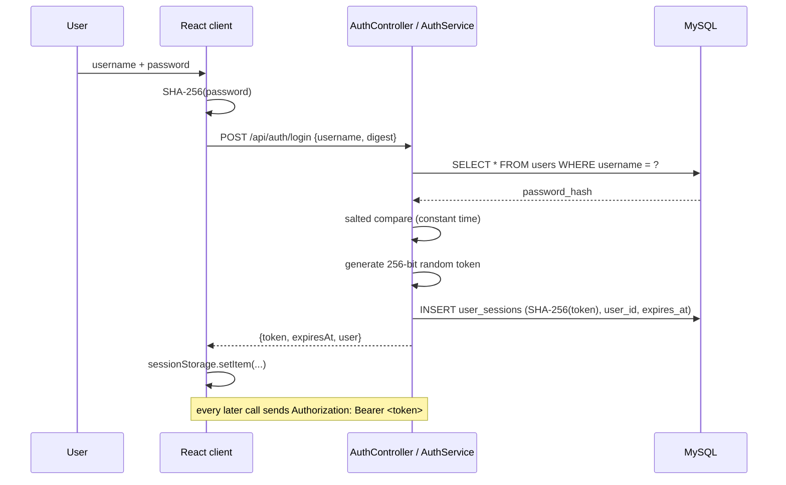
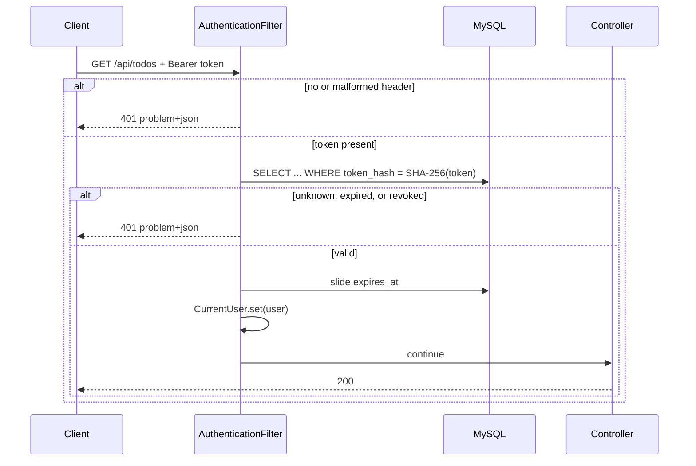
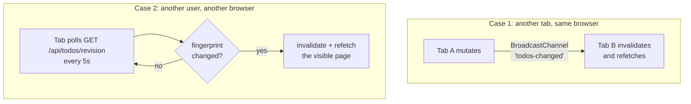
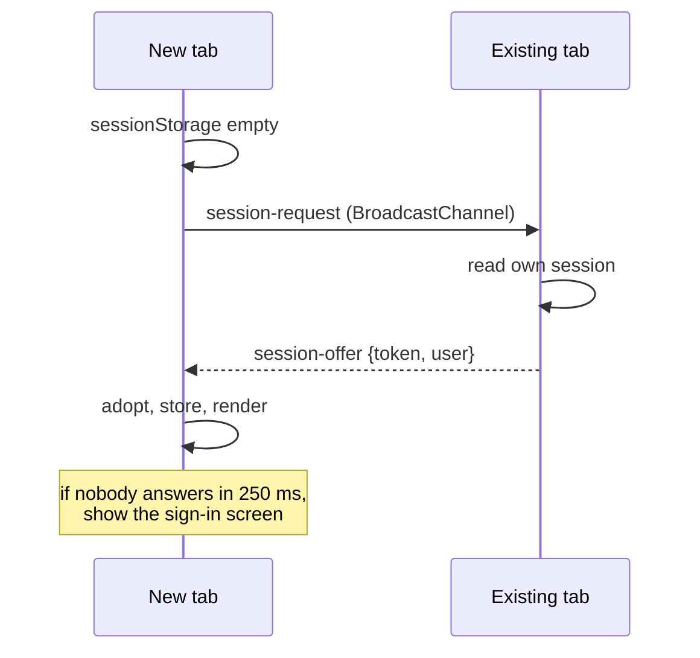

# Architecture

Two features are described here: **authentication with database-backed
sessions**, and **keeping every open client current**. The rest of the system is
covered in the [decision log](DECISION_LOG.md).

## System overview


A second browser tab is a second copy of the `Browser` box. Tabs share the
BroadcastChannel; they do **not** share sessionStorage, which is what the
handshake below is for.

## Authentication

### Where hashing happens, and why twice



The two steps solve different problems, and neither replaces the other:

| Step | Protects against | Does **not** protect against |
|---|---|---|
| Client-side SHA-256 | The server, its logs, and anything on the path ever seeing the real password — which matters because people reuse passwords | Anyone who steals the digest: to this API, the digest *is* the password |
| Server-side salted SHA-256 | A stolen `users` table revealing credentials; identical passwords sharing a digest | Brute force — SHA-256 is fast |

**SHA-256 is a starting point, not a destination.** It is designed to be fast,
which is the opposite of what a password digest wants: commodity hardware tests
billions of candidates a second. The salt defeats rainbow tables and stops two
users with the same password sharing a digest, but it does nothing about brute
force.

The upgrade is deliberately cheap. Every digest records the algorithm that wrote
it, so more than one can coexist:

```
sha256$Zk3n…$816a01455a4f…
└────┘
 algorithm
```

Introducing Argon2 means adding one `PasswordHasher` implementation and making
it primary. `AuthService.login` already re-hashes any digest whose prefix is not
the current algorithm, at the one moment the password is available. No
migration, no forced reset, no downtime.

### Sign-in and the session



Three properties worth stating explicitly:

- **The token is opaque, not a JWT.** Sessions live in the database, so
  revocation is an `UPDATE` — no blocklist, no waiting for a short expiry. That
  is what "a session generated in db" asks for, and it is the right trade for
  a single service where the extra round trip is a primary-key lookup.
- **Only `SHA-256(token)` is stored.** Reading `user_sessions` yields nothing
  usable, the same reasoning that applies to passwords.
- **Expiry slides.** Each authenticated request pushes `expires_at` forward, so
  an active user is not signed out mid-task, while an abandoned session still
  ages out.

### Request path



`/api/auth/register` and `/api/auth/login` are open — otherwise no token could
ever be obtained. Swagger UI and `/actuator/health` sit outside `/api` and are
untouched by the filter. CORS preflights pass through, because a browser never
attaches credentials to them and a 401 there surfaces as an opaque CORS error
rather than something a developer can act on.

### One shared list, many users

Authentication gates *access*; it does not partition data. The original
requirement is explicit that the API should "support multiple users accessing
the same TODO list concurrently" — one list, several people. TODOs therefore
have no owner column, and any signed-in user sees and edits the same list.
Per-user lists would be a different product; the change would be an owner
column plus a predicate on every query.

## Real-time updates

The requirement asks for a simple mechanism, not a live collaboration engine.
Two cheap ones, covering the two cases that actually differ:



### The revision endpoint

Polling the list itself would move a page of rows every five seconds per tab.
Instead clients poll a fingerprint:

```json
GET /api/todos/revision → { "lastModifiedAt": "2026-08-25T10:59:35.164911Z", "total": 12009 }
```

Two aggregates over an indexed column — **measured at 5 ms against 12,009
rows**, versus ~20 ms to return an actual page. The client refetches only when
the pair changes.

- `lastModifiedAt` moves on every insert, update, **and** soft delete, because
  deletion stamps `updated_at` rather than removing the row.
- `total` covers the one case a timestamp alone could miss: two writes inside
  the same microsecond.

This depends on all writers agreeing on a clock. Timestamps are written by the
application in UTC; the seed script had to be corrected to `UTC_TIMESTAMP(6)`
after it wrote local time and left rows dated in the future, which masked real
edits. Worth knowing before adding another writer.

### Cross-tab messaging

`BroadcastChannel` gives same-origin tabs a message bus with no server involved,
so a change made in one tab lands in the others immediately rather than up to
five seconds later. It carries three kinds of message:

| Message | Sent when | Effect |
|---|---|---|
| `todos-changed` | after any local mutation | other tabs invalidate and refetch |
| `session-request` / `session-offer` | a new tab opens with empty sessionStorage | an existing tab hands over the session |
| `signed-out` | sign-out | other tabs return to the sign-in screen |

Every call degrades to a no-op where `BroadcastChannel` is unavailable (older
Safari); the app then relies on polling alone, which is slower but correct.

### The sessionStorage handshake

sessionStorage is per-tab by design: closing the tab ends the session and
nothing is written to disk. The cost is that opening a second tab would
otherwise demand a fresh sign-in — awkward for a feature whose entire point is
multiple tabs.



**The trade-off, stated plainly:** any same-origin tab can ask for the token.
That is no weaker than putting the token in `localStorage` — where every tab
reads it directly — but it is weaker than pure per-tab isolation. The exposure
is bounded by the same-origin policy; an XSS foothold defeats all three schemes
equally. `httpOnly` cookies would be strictly better against XSS, at the cost of
CSRF handling, which is the change I would make before this saw real users.

## Why not WebSockets or SSE

Both were considered and neither earns its cost here:

| Approach | Cost | Verdict |
|---|---|---|
| Polling a fingerprint | One 5 ms query per tab per 5 s; up to 5 s stale | **Chosen.** Stateless, survives restarts and load balancers, trivial to reason about |
| Server-Sent Events | A held connection per client; needs an event bus to fan out across instances | The natural next step if latency matters |
| WebSockets | As above, plus protocol and reconnection handling | Only worth it for bidirectional traffic — presence, cursors, live editing |

Polling cost scales with connected clients, not with list size, and the poll is
paused for hidden tabs. At the scale in the brief that is comfortable. The
upgrade path is contained: `useRealtimeSync` is the only place that decides
*when* to invalidate, so swapping the trigger for an SSE subscription touches
one hook.

## What is not built

- **No per-user data.** One shared list, as the requirement describes.
- **No roles or permissions.** Every signed-in user can do everything.
- **No password reset, email verification, or rate limiting.** Sign-in is not
  throttled, which a real deployment needs before anything else on this list.
- **No conflict merging.** Two people editing the same TODO still resolve
  through optimistic locking: the second writer gets a 409 and refetches. Live
  updates make that collision rarer, not impossible.
